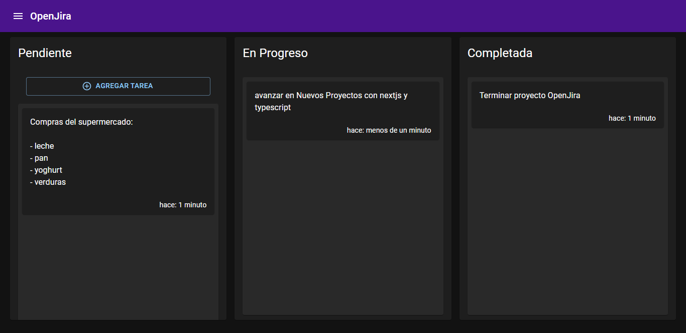
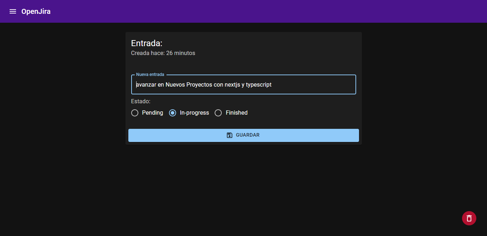
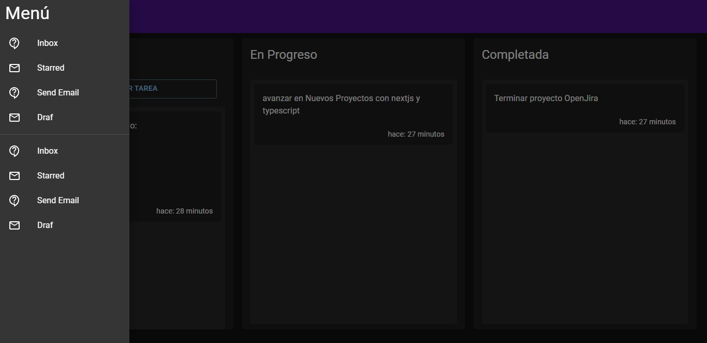

# Next.js OpenJira App

Los pasos para levantar el proyecto OpenJira en desarrollo usando docker, mongodb y nextjs:

## Levantar la base de datos

```
docker-compose up -d
```

- El -d, significa **detache**

## Configurar las variables de entrono

- Renombrar el archivo **.env.templante** a **.env**

- MOngoDB URL Local:

```
mongodb://localhost:27017/entriesdb
```

## Reconstruir los modulos de Node y levantar Nextjs

```
npm install
npm run dev
```

## Llenar la base de datos de informacion de prueba

- llamar a:

```
http://localhost:3000/api/seed
```

## Imagenes de la App




